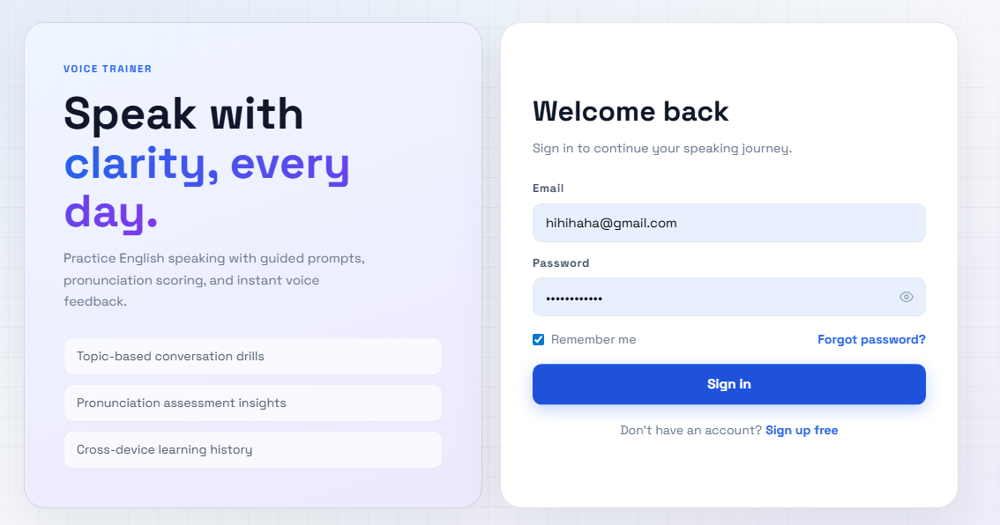
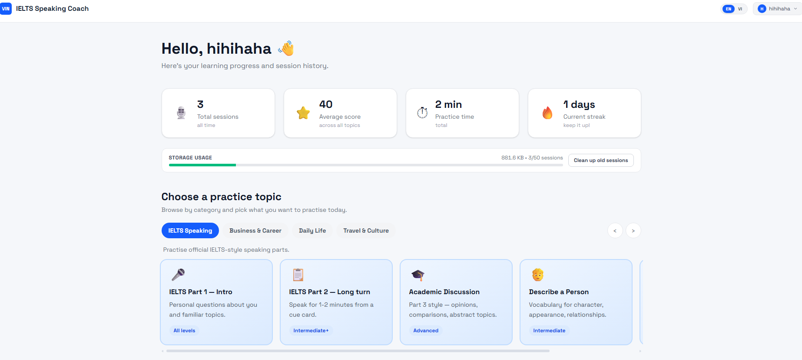
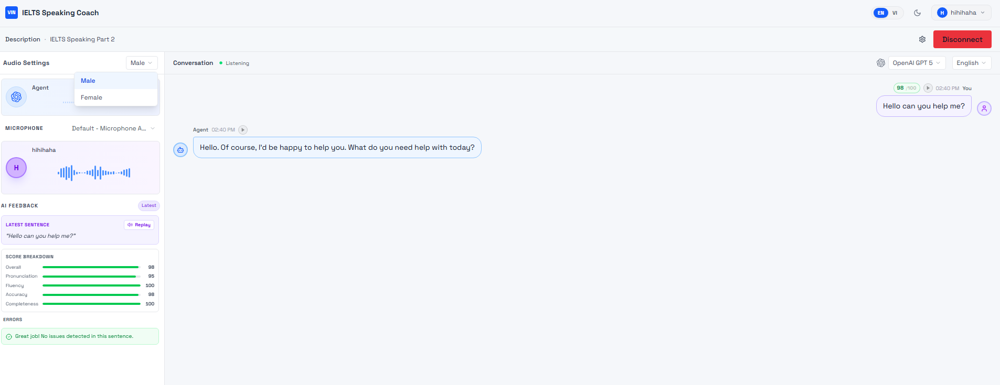
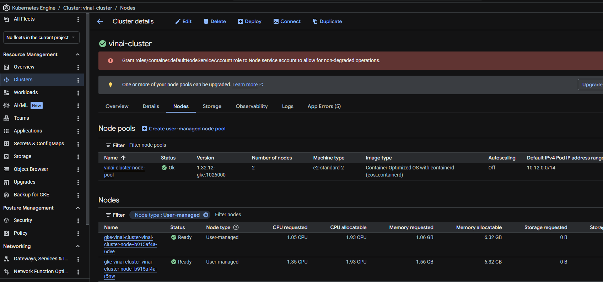
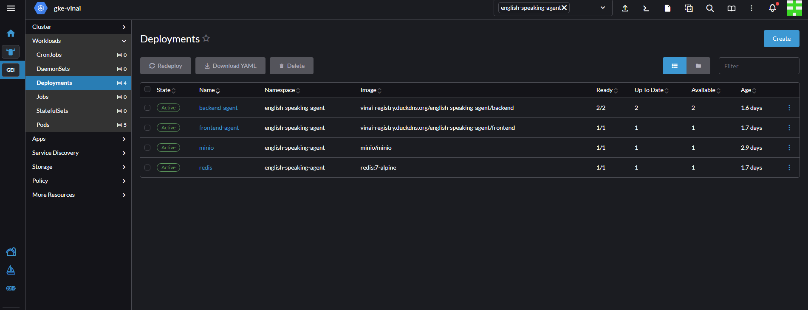
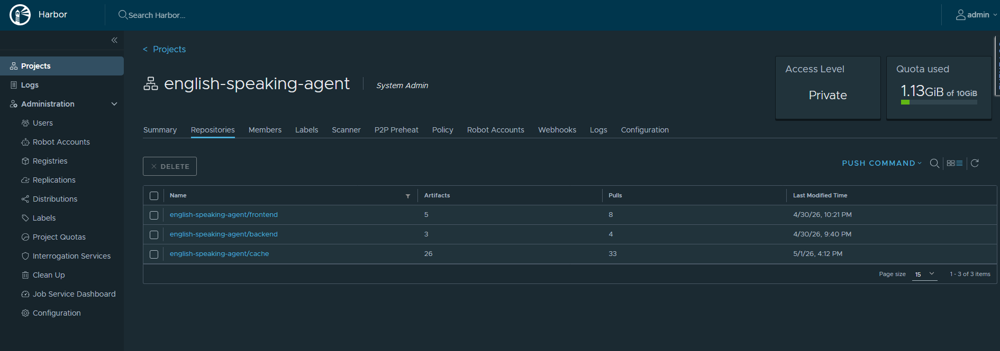
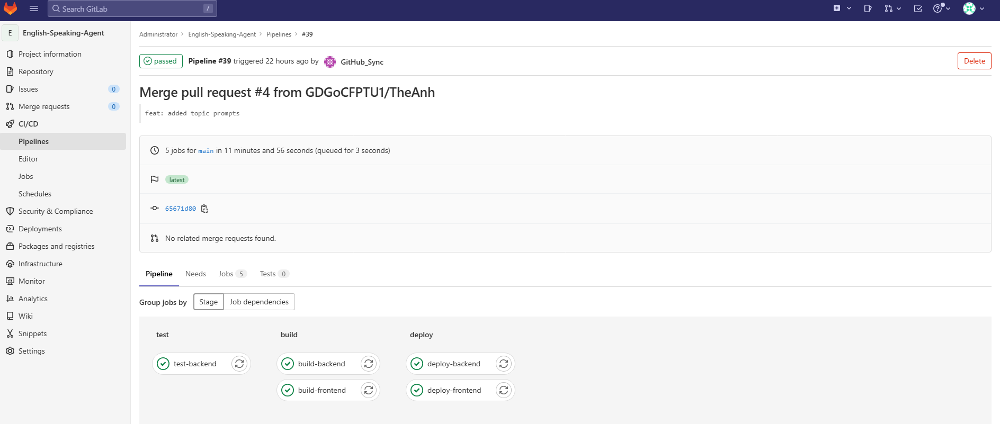
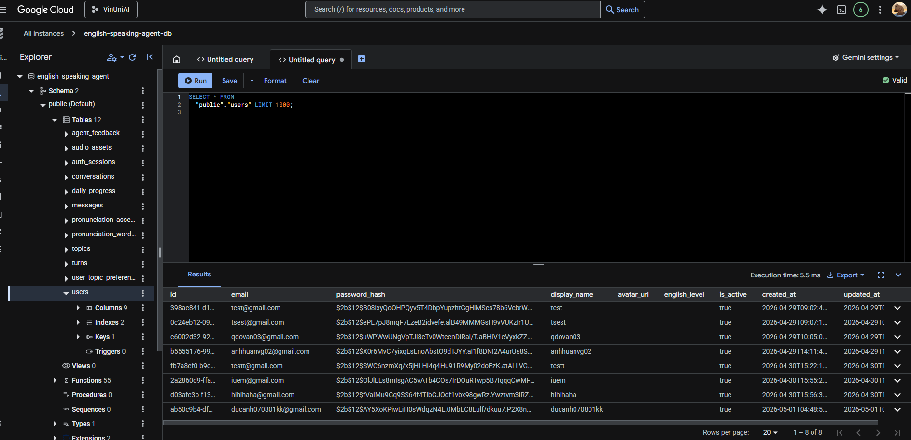

# **BÁO CÁO TIẾN ĐỘ DỰ ÁN AI AGENT LUYỆN NÓI TIẾNG ANH**
Nhóm 14 - VinAI
## **1. Tổng quan dự án**

Dự án xây dựng một hệ thống AI Agent hỗ trợ người dùng luyện nói tiếng Anh thông qua hội thoại tương tác, tích hợp công nghệ xử lý ngôn ngữ tự nhiên (LLM), tổng hợp giọng nói (TTS), và đánh giá phát âm. Hệ thống được thiết kế theo kiến trúc microservices, triển khai trên nền tảng cloud với khả năng mở rộng và tự động hóa cao.
## Link sản phẩm: https://vinai-speaking-agent.duckdns.org/

Tài khoản test:
- username
```
vinai@vin.com
```
- password:
```
Vinai2A2026+
```
## **2. Các hạng mục đã hoàn thành**

### **2.1. Frontend – Backend (Core Features)**

Trong giai đoạn hiện tại, hệ thống đã hoàn thiện các chức năng cốt lõi phục vụ trải nghiệm người dùng:

* Xây dựng hệ thống **xác thực người dùng** bao gồm đăng ký và đăng nhập.
* Phát triển tính năng **lựa chọn chủ đề (topics)** để cá nhân hóa nội dung luyện tập.
* Triển khai chức năng **giao tiếp trực tiếp với AI Agent**, hỗ trợ hội thoại theo thời gian thực.
* Tích hợp dịch vụ **ElevenLabs** để xử lý chuyển đổi văn bản thành giọng nói (Text-to-Speech), trả về voice tự nhiên cho Agent.
* Hiển thị **kết quả chấm điểm phát âm** của người dùng sau mỗi lượt nói.
* Xây dựng cơ chế **lưu trữ lịch sử hội thoại** vào hệ thống database.
* Lưu trữ file voice của người dùng vào hệ thống object storage **MinIO**.
* Cho phép người dùng lựa chọn **giọng nói (nam/nữ)** cho Agent.





---

### **2.2. Hạ tầng (Infrastructure & DevOps)**


#### **Triển khai bằng Terraform trên Google Cloud Platform**

* Khởi tạo **01 cụm Kubernetes (K8s)**:

  * Quy mô: 2 nodes
  * Instance type: e2-standard-n2
  * Đảm bảo khả năng scale và orchestration container

#### **Hệ thống server hỗ trợ (Self-hosted services)**

Triển khai 4 server phục vụ DevOps pipeline: 2Gi Ram - 20Gi disk

* **Rancher Server**: Quản lý cluster Kubernetes, deployment, monitoring - https://vinai-rancher.duckdns.org/dashboard/

* **Harbor Server**: Private Docker Registry phục vụ lưu trữ images - https://vinai-registry.duckdns.org/

* **GitLab Server**: Quản lý source code và pipeline CI/CD - https://gitlab-vinai.duckdns.org/
* **GitLab Runner**: Thực thi pipeline tự động
    
#### **Database**

* Sử dụng **Cloud SQL** (GCP)

---

### **2.3. Quy trình CI/CD hiện tại**

Pipeline CI/CD đã được thiết lập với luồng tự động hóa như sau:

```
Push code lên GitHub
        ↓
Sync sang GitLab (chỉ nhánh main)
        ↓
GitLab Runner thực thi pipeline:
    - Chạy pytest
    - Nếu fail → dừng pipeline
    - Nếu pass → tiếp tục
        ↓
Phát hiện thay đổi (frontend / backend / deployment)
        ↓
Build Docker image (Kaniko)
        ↓
Push image lên Harbor
        ↓
Kubernetes pull image và deploy
```

Luồng này đảm bảo:

* Kiểm soát chất lượng code (test gating)
* Tự động hóa build & deploy
---

## **3. Kế hoạch giai đoạn tiếp theo**

### **3.1. Frontend**

* Thiết kế lại **UI/UX** nhằm cải thiện trải nghiệm người dùng:

  * Tối ưu giao diện hội thoại
  * Cải thiện feedback khi luyện nói
  * Thêm hiển thị học từ điển bằng flashcard
* Triển khai cơ chế **cache dữ liệu tin nhắn**:

  * Giảm latency
  * Tăng tốc độ hiển thị lịch sử chat

---

### **3.2. Backend**

* Phát triển thêm các API:

  * Lấy lịch sử chat
  * Xóa lịch sử chat
  * Chấm điểm ngữ pháp
  * Thêm dữ liệu flashcard
  * Thêm tool thêm mới từ điển vào flashcard cho agent
* Tích hợp **Guardrails cho input/output**:

  * Kiểm soát nội dung người dùng
  * Hạn chế hallucination và phản hồi không phù hợp từ LLM
* Thiết kế và tối ưu **prompt engineering**:

  * Cải thiện chất lượng hội thoại
  * Cá nhân hóa phản hồi theo user

---

### **3.3. Hạ tầng & Giám sát hệ thống**

* Tối ưu lại pipeline CI/CD:

  * Giảm thời gian build
  * Tăng hiệu quả detect thay đổi
* Xây dựng hệ thống **logging & monitoring**:

  * Theo dõi hiệu năng ứng dụng
  * Phát hiện lỗi và bottleneck

Dự kiến triển khai logging stack theo một trong hai hướng:

* **ELK Stack**: Elasticsearch – Logstash – Kibana
* **VEK Stack**: Vector – Elasticsearch – Kibana

Trong đó, **Vector** được đánh giá nhẹ hơn Logstash và phù hợp với hệ thống cần tối ưu tài nguyên.

